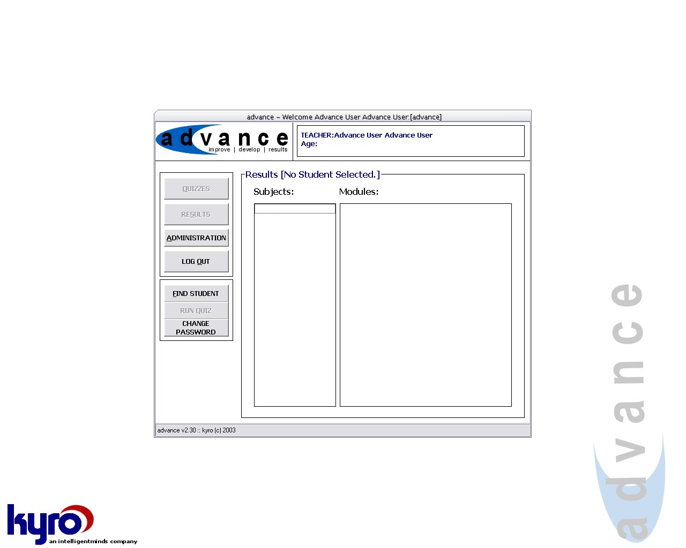



## Advance \- Multiple Choice Quiz System

### Description

A complete multiple choice quiz system, with results analysis and administration.
 
### More Info
 

             |
---                |---
**Submitted On**   |2003-04-06 00:04:10
**By**             |[Mike Brook](https://github.com/Planet-Source-Code/PSCIndex/blob/master/ByAuthor/mike-brook.md)
**Level**          |Intermediate
**User Rating**    |4.7 (47 globes from 10 users)
**Compatibility**  |VB 6\.0
**Category**       |[Complete Applications](https://github.com/Planet-Source-Code/PSCIndex/blob/master/ByCategory/complete-applications__1-27.md)
**World**          |[Visual Basic](https://github.com/Planet-Source-Code/PSCIndex/blob/master/ByWorld/visual-basic.md)
**Archive File**   |[Advance\_\-\_157038472003\.zip](https://github.com/Planet-Source-Code/mike-brook-advance-multiple-choice-quiz-system__1-44570/archive/master.zip)

